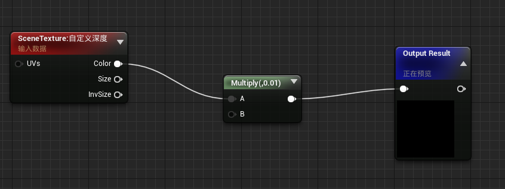
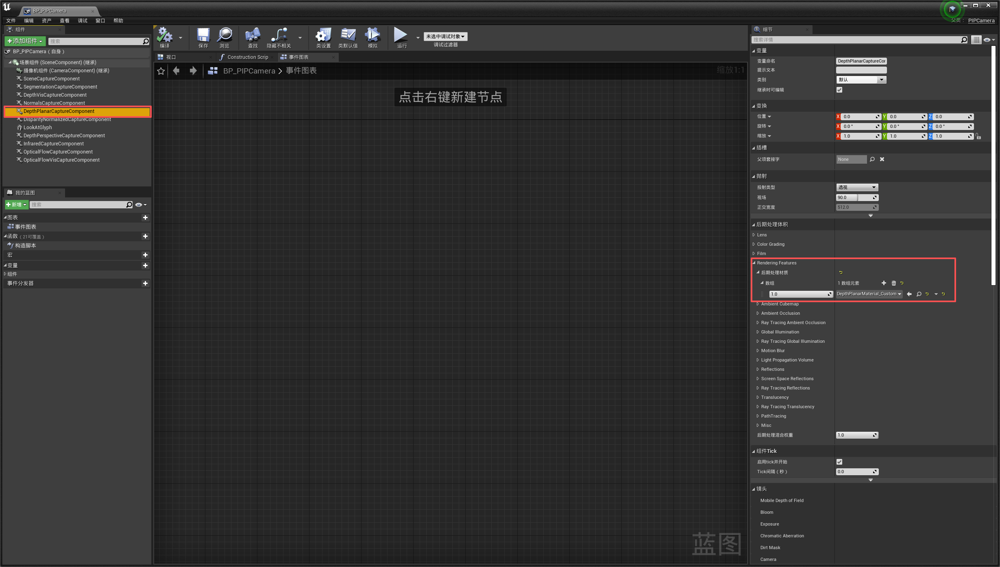

### Airsim默认的飞机太大了，如何调小一点  
https://www.youtube.com/watch?v=Bp86WiLUC80
1. 找到Airsim/Unreal/Environments/Blocks/Plugins/Airsim/Content/Blueprints/BP_FlyingPawn.uasset，复制到Blocks/Content下
2. 打开编辑器，双击Content下复制过来的模型，选择视口，点击无人机mesh部分，点击右侧静态网格体下放大镜图标，关闭当前窗口
3. 此时内容浏览器会被导航到Airsim内容下，找到Quadrotor1，右键-资产操作-导出，将其导出为fbx文件，重命名为MyQuadrotor
4. 右键内容浏览器中空白处，导入刚才的fbx文件，设置导入时的缩放变换，默认的边长为1000mm（轴距=根号2×边长）
5. 得到MyQuadrotor的mesh，作为我们蓝图类的mesh
6. 进入Airsim内容/Blueprints，将BP_FlyingPawn复制一份，重命名为BP_300（这里300指边长）
7. 双击，将右侧的静态网格体改为刚才创建的缩放版本的mesh MyQuadrotor，缩放以后螺旋桨的位置和大小也要对应修改（所有值乘上scale即可）
8. 保存，并在settings.json最外层加上这一项，用我们自定义的蓝图类
```
"PawnPaths": {
        "DefaultQuadrotor": {"PawnBP": "Class'/Airsim/Blueprints/BP_300.BP_300_C'"}
    },
```
### 编辑器点击“弹出”后，ros话题消失
玩家和控制器分离后，相机的图像就会读取不到，按B+M用键盘控制视角移动吧

### Airsim如何让玻璃等半透明材质的深度(depthPlanar)显示自身
1. 找到Airsim/Unreal/Environments/Blocks/Plugins/Airsim/Content/Blueprints/BP_FlyingPawn.uasset，复制到Blocks/Content下
2. 打开编辑器，双击Content下复制过来的模型，选择视口，点击无人机mesh部分，点击右侧静态网格体下放大镜图标，关闭当前窗口
3. 内容浏览器导航到Airsim内容下，找到DepthPlanarMaterial，拷贝一份命名为DepthPlanarMaterial_Custom，找到DepthPlanarMaterialFunc，拷贝一份，命名为DepthPlanarMaterialFunc_custom
4. 打开DepthPlanarMaterialFunc_custom，将其蓝图改为：

5. 打开DepthPlanarMaterial_Custom，将原本连接的function改为修改后的custom版本
6. 在airsim内容中找到BP_PIPCamera，修改这两处

7. 对任意场景中需要修改深度渲染逻辑的半透明物体，先点击他的mesh，在细节处找到对应的半透明材质（例如M_Glass），双击打开
8. 左下角细节搜索框内输入custom，找到允许自定义深度写入，勾选
9. 左下角细节搜索框内输入clip，将不透明度蒙版剪切值设为0.0

### Airsim如何关闭窗外自然光导致镜头前面有光斑
找到场景的postprocessvolume (世界大纲视图里面 actor中找 一般搜索post)  
镜头lens flare强度和bloom强度都设置为0.0

### Airsim场景里面有类似白雾的东西 影响渲染清晰度
检查场景是否有Exponential Height Fog，去掉